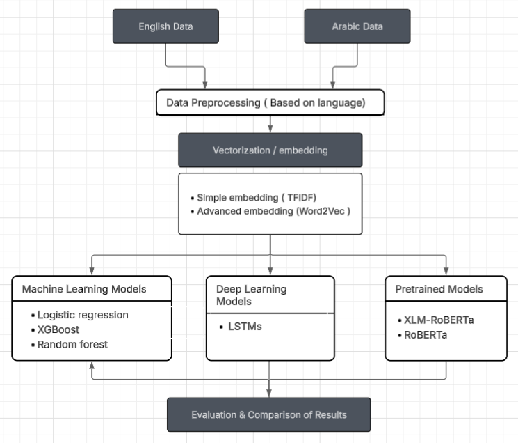
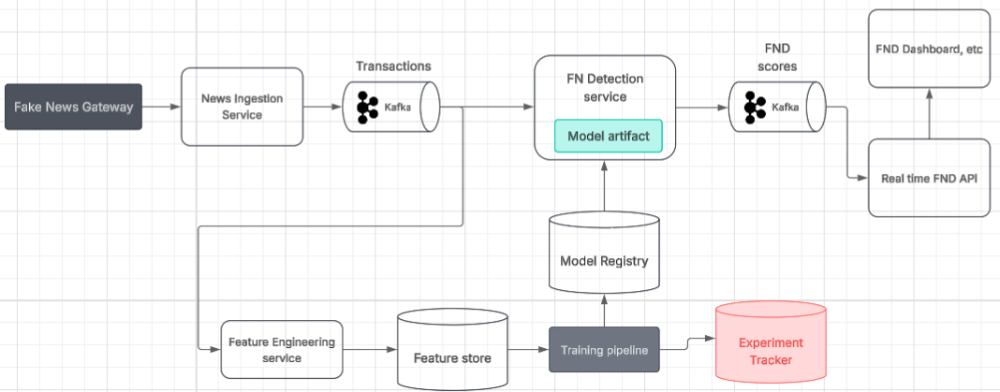

# Multilingual Fake News Detection System



## Overview
This project implements a comprehensive fake news detection system supporting both English and Arabic languages. It uses various machine learning and deep learning approaches to classify news articles as either real or fake. The system provides a user-friendly web interface built with Streamlit for real-time fake news detection.

## Features
- **Multilingual Support**: Processes and analyzes both English and Arabic text
- **Multiple Model Implementations**:
  - Traditional ML models (Logistic Regression, SVM, Random Forest, XGBoost, Gradient Boosting)
  - Deep learning models (LSTM with pre-trained Word2Vec embeddings)
  - Transformer-based models (XLM-RoBERTa)
- **Advanced Text Preprocessing**:
  - Language-specific processing pipelines
  - Custom `TextPreprocessor` class for both languages
  - Special handling for Arabic-specific features (diacritics, normalization)
- **Interactive Web Application**:
  - Model selection interface
  - Real-time prediction
  - Detailed results visualization
- **Comprehensive Evaluation Metrics**:
  - Accuracy, Precision, Recall, F1-score
  - ROC curves and AUC scores
  - Confusion matrices
  - Classification reports

## Project Structure
```
├── Cleaned_Data/               # Processed datasets
│   ├── processed_ar_data.csv   # Processed Arabic dataset
│   └── processed_en_data.csv   # Processed English dataset
├── Master_Data/                # Original datasets
│   ├── English Data/
│   │   └── WELFake_Dataset.csv
│   └── Arabic Data/
├── Models/                     # Trained models
│   ├── Arabic/                 # Models for Arabic language
│   │   ├── Logistic Regression_model.pkl
│   │   ├── SVM_model.pkl
│   │   ├── Random Forest_model.pkl
│   │   ├── XGBoost_model.pkl
│   │   ├── Gradient Boosting_model.pkl
│   │   ├── lstm.h5
│   │   └── prerainmodel/       # Fine-tuned XLM-RoBERTa model
│   └── English/                # Models for English language
│       ├── Logistic Regression_model.pkl
│       ├── SVM_model.pkl
│       ├── Random Forest_model.pkl
│       ├── XGBoost_model.pkl
│       ├── Gradient Boosting_model.pkl
│       ├── lstm.h5
│       └── prerainmodel/       # Fine-tuned XLM-RoBERTa model
├── images/                     # Images for documentation
├── Preprocessing.ipynb         # Data preprocessing notebook
├── fnd-notebook-arabic.ipynb   # Model training for Arabic
├── fnd-notebook-english.ipynb  # Model training for English
├── app.py                      # Streamlit web application
├── requirements.txt            # Project dependencies
└── README.md                   # Project documentation
```

## Installation

### Requirements
Install all required packages using:
```bash
pip install -r requirements.txt
```

Or install individual packages:
```bash
pip install streamlit farasapy tqdm gensim spacy scipy wandb nltk tensorflow torch transformers datasets xgboost
```

### Additional Downloads
```python
import nltk
nltk.download('stopwords')
nltk.download('punkt')
nltk.download('wordnet')

import spacy
spacy.cli.download("en_core_web_sm")
```

### Word Embeddings
For optimal performance, download the following pre-trained word embeddings:
- **For Arabic**: Download `cc.ar.300.bin` from [FastText](https://fasttext.cc/docs/en/crawl-vectors.html)
- **For English**: Download `GoogleNews-vectors-negative300.bin` from [Google's Word2Vec](https://code.google.com/archive/p/word2vec/)

Place the downloaded files in an accessible location and update the file paths in the notebooks.

## Usage Guide

Follow these steps to set up and use the Fake News Detection system:

### 1. Download Datasets

#### English Dataset
Download the WELFake dataset:
- Source: [WELFake Dataset on Kaggle](https://www.kaggle.com/datasets/saurabhshahane/fake-news-classification)
- Place the downloaded `WELFake_Dataset.csv` file in the `Master_Data/English Data/` directory

#### Arabic Dataset
Download the Arabic fake news dataset:
- Source: [Arabic Fake News Dataset on Hugging Face](https://huggingface.co/datasets/Nahla-yasmine/arabic_fake_news)
- You can load it directly in the preprocessing notebook using:
  ```python
  df_ar = pd.read_csv("hf://datasets/Nahla-yasmine/arabic_fake_news/final_data.csv")
  ```

### 2. Run Preprocessing

1. Open and run the `Preprocessing.ipynb` notebook
2. This notebook will:
   - Load the raw datasets
   - Clean and preprocess the text
   - Apply language-specific processing
   - Save the processed datasets to the `Cleaned_Data/` directory

### 3. Train Models

#### For Arabic Models
1. Open and run the `fnd-notebook-arabic.ipynb` notebook
2. This will train and evaluate:
   - Traditional ML models (Logistic Regression, SVM, Random Forest, etc.)
   - LSTM model with word embeddings
   - XLM-RoBERTa transformer model
3. Trained models will be saved to the `Models/Arabic/` directory

#### For English Models
1. Open and run the `fnd-notebook-english.ipynb` notebook
2. This will train and evaluate the same set of models for English data
3. Trained models will be saved to the `Models/English/` directory

### 4. Launch the Web Application

Once the models are trained, you can run the Streamlit web application:

```bash
streamlit run app.py
```

The application will:
- Load all trained models
- Provide a user interface for selecting models and languages
- Allow you to input news text for classification
- Display prediction results in real-time

### 5. Using the Web Application

1. Select your preferred model from the dropdown menu
2. Choose the language (English or Arabic)
3. Enter or paste the news text you want to analyze
4. Click "Analyze News" to get the prediction result

## Data Preprocessing
The `Preprocessing.ipynb` notebook contains a comprehensive text preprocessing pipeline implemented through the `TextPreprocessor` class:

- **Text Cleaning**:
  - Removing punctuation, digits, and special characters
  - Normalizing whitespace
  - Handling URLs and HTML tags

- **Language-Specific Processing**:
  - **English**: Lowercase conversion, tokenization with SpaCy
  - **Arabic**: Character normalization, diacritics removal, Farasa segmentation

- **Feature Engineering**:
  - Tokenization
  - Stopword removal
  - Stemming/Lemmatization
  - Text length filtering

The preprocessed datasets are saved to the `Cleaned_Data` directory for use in model training.

## Model Training

### Traditional ML Models
Both notebooks (`fnd-notebook-arabic.ipynb` and `fnd-notebook-english.ipynb`) train and evaluate the following models using TF-IDF vectorization:

- **Logistic Regression**: Fast baseline model with good interpretability
- **Support Vector Machine (SVM)**: Effective for high-dimensional text data
- **Random Forest**: Robust ensemble method with good generalization
- **Gradient Boosting**: Advanced boosting algorithm for improved performance
- **XGBoost**: State-of-the-art gradient boosting implementation

### Deep Learning Models
LSTM-based models with pre-trained word embeddings:

- **Architecture**:
  - Embedding layer initialized with pre-trained vectors
  - Bidirectional LSTM layers for capturing context
  - Dropout and BatchNormalization for regularization
  - Dense layers with sigmoid activation for binary classification

- **Training**:
  - Early stopping to prevent overfitting
  - Learning rate reduction on plateau
  - Binary cross-entropy loss function

### Transformer Models
Fine-tuned XLM-RoBERTa models for both languages:

- **Implementation**:
  - Leverages Hugging Face's Transformers library
  - Supports cross-lingual transfer learning
  - Fine-tuned on language-specific datasets

- **Training Process**:
  - Uses Weights & Biases for experiment tracking
  - Gradient accumulation for handling larger batch sizes
  - Learning rate scheduling for optimal convergence

## Web Application
The project includes a Streamlit web application (`app.py`) that provides:

- **User Interface**:
  - Model selection dropdown (XLM-RoBERTa, LSTM, traditional ML models)
  - Language selection (English/Arabic)
  - Text input area for news content

- **Features**:
  - Real-time prediction
  - Confidence scores
  - Model information and explanations
  - Optional external fact-checking API integration

To run the application:
```bash
streamlit run app.py
```

## Evaluation
Models are evaluated using a comprehensive set of metrics:

- **Classification Metrics**:
  - Accuracy: Overall correctness of predictions
  - Precision: Ratio of true positives to all positive predictions
  - Recall: Ratio of true positives to all actual positives
  - F1-score: Harmonic mean of precision and recall

- **Visualization**:
  - ROC curves and AUC scores
  - Confusion matrices
  - Learning curves for deep learning models

## Results
Performance varies by model and language, with the best models achieving:

- **English**:
  - XLM-RoBERTa: 97-98.5% accuracy
  - LSTM: 96-97% accuracy
  - Traditional ML: 94-96% accuracy

- **Arabic**:
  - XLM-RoBERTa: 90-93% accuracy
  - LSTM: 85-89% accuracy
  - Traditional ML: 80-85% accuracy

## Future Work


- **Model Improvements**:
  - Implement ensemble methods combining multiple models
  - Explore more advanced transformer architectures (DeBERTa, ELECTRA)
  - Incorporate attention mechanisms for better interpretability

- **Feature Expansion**:
  - Add support for more languages
  - Incorporate social context features (user behavior, sharing patterns)
  - Include metadata analysis (source credibility, publication date)

- **System Enhancements**:
  - Deploy as a cloud-based API service
  - Develop browser extensions for real-time detection
  - Create mobile applications for on-the-go fact-checking

- **Research Directions**:
  - Explore explainable AI techniques for model interpretability
  - Investigate adversarial attacks and defenses
  - Research transfer learning across languages and domains

## License
This project is licensed under the MIT License - see the LICENSE file for details.

## Acknowledgments
- FastText and Google for providing pre-trained word embeddings
- Hugging Face for the Transformers library
- The open-source NLP community for tools and resources